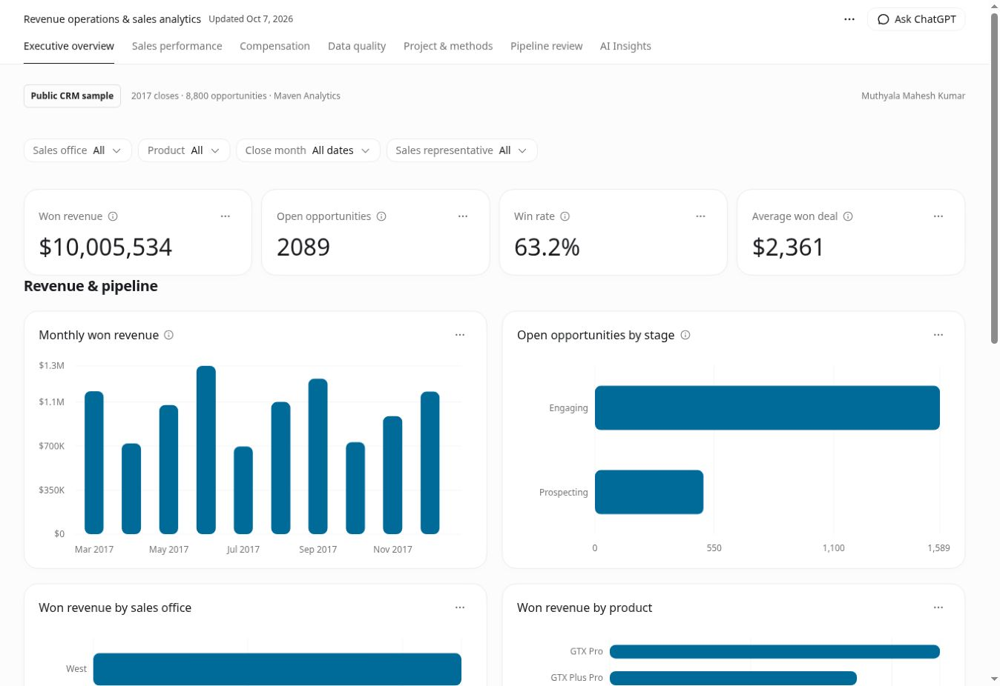
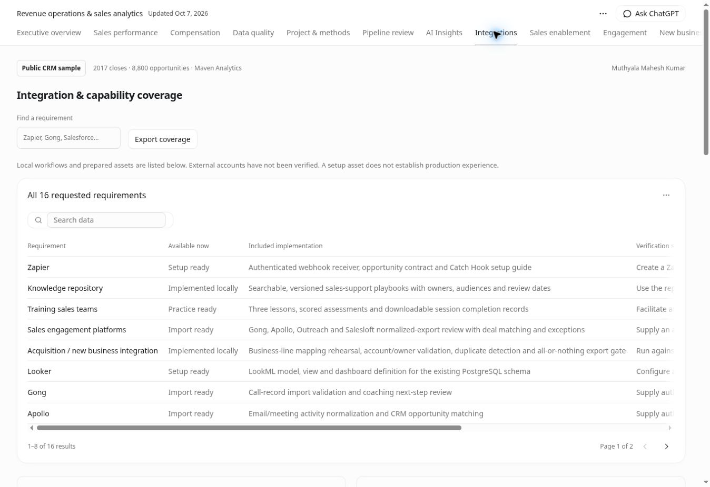

# Salesforce Revenue Operations AI
**A portfolio project by Muthyala Mahesh Kumar**

[Open live dashboard](https://mahesh-revenue-operations.r58144805.chatgpt.site/) · [Watch the sample walkthrough](demo/revenue-operations-walkthrough.mp4)




## Updated operations workspace

Start with **[documentation/START-HERE.md](documentation/START-HERE.md)**. Open the bundled `dashboard.html` for a portable local app with all 13 views. Existing CRM analytics and source records are preserved.

Added searchable/versioned sales-support playbooks, three scored training exercises, normalized Gong/Apollo/Outreach/Salesloft export validation, business-line mapping dry-runs, cent-rounded commission review rehearsal, developer handoff backlog and Sales/CSM/Marketing brief drafts. **Integrations** explicitly lists all 16 requested requirements and the evidence still needed. These features demonstrate portfolio implementation; actual team training, developer collaboration, employer communication and real compensation processing are not claimed.

The backend adds authenticated Zapier/n8n event ingress, role-separated durable commission rehearsal and self-attested evidence receipts. Native Salesforce Report XML and a LookML model/dashboard kit are included. Native Salesforce, Looker, Zapier, n8n, Gong/Apollo and Power BI execution remain pending connected environments. See [operations API](documentation/operations-api.md) and [requirement coverage](documentation/requirement-coverage.md). No messages, CRM changes or payments were performed.

The live dashboard preserves the existing URL. The demo walkthrough and screenshots show the operations update; native platform execution remains separately unverified.

## 1. Overview
A public CRM sample turned into inspectable sales reporting, operational review rules, data-quality checks and simulated commissions. Includes React pages, a runnable API, LangChain analysis code and an n8n workflow template.

## 2. Business problem
Reliable CRM records are required before a team can value pipeline, compare performance or approve commissions. This project keeps missing evidence visible and connects review actions to source records.

## 3. Live demo
https://mahesh-revenue-operations.r58144805.chatgpt.site

Thirteen views in this updated package: Executive overview, Pipeline review, AI Insights, Sales performance, Compensation, Data quality, Integrations, Sales enablement, Engagement, New business, Payout review, Team handoff, Project & methods. The latest operations workspace is published at the same live URL. The site uses an API-loaded published snapshot; it is not a continuous Salesforce feed. The separate FastAPI service is not publicly deployed.

## 4. Technology stack
Implemented: Python, Pandas notebooks, SQL, JavaScript/React, FastAPI, LangChain prompt/parser chain and Git source history. Prepared integrations: Salesforce REST, PostgreSQL, Power BI and n8n. CSVs are Excel-compatible. See the detailed status matrix in documentation/implementation-matrix.md.

## 5. Architecture
Sample CSV → Python validation → reviewed snapshot API → React reporting. The separate integration path is Salesforce → n8n → validation → FastAPI → optional LangChain draft → stored review outbox. PostgreSQL can back the API after configuration. See documentation/architecture.md.

## 6. Dataset
Maven Analytics' public-domain fictional computer-hardware CRM sample: 8,800 opportunities, 85 accounts, 35 listed agents and 7 products. Contacts, leads, actual quotas and commission plans are absent. Extra entities are not invented to hit approximate blueprint counts.

## 7. Source and lineage
Official: https://mavenanalytics.io/data-playground/crm-sales-opportunities
Mirror: https://github.com/ZeinabBagherifard/CRM-Sales-Opportunities
Only the five CSVs were downloaded; no third-party application/analysis code was copied. Original bytes, SHA-256 validation and the source receipt are included.

## 8. Salesforce objects
Lead, Account, Contact and Opportunity fields are specified in salesforce/data-model.md. Import files use portfolio external IDs; map account/owner keys to actual org IDs before import. The org has not been configured here.

## 9. Starter import
salesforce/starter/opportunities_500.csv is a deterministic 500-record closed-deal subset. All 6,711 closed source deals are also supplied. Open deals require valid source CloseDate before native import; dates are not fabricated.

## 10. Salesforce reports
Six report specifications and an executive dashboard specification cover pipeline stages, rep/region revenue, won/lost, monthly value and scenario target achievement. These are configuration assets, not deployed native reports. Native Metadata API Report/ReportFolder XML has now been added with a sandbox dry-run/deployment guide in `salesforce/native-reports.md`; native deployment remains unverified.

## 11. Cleaning
python/data_cleaning.py verifies source hashes, IDs, relationships, closed-deal values and date order. 1,480 product keys map GTXPro to GTX Pro; source bytes remain unchanged.

## 12. Quality
8,800 rows retained; duplicates removed: 0. Missing accounts: 1,425. Open amounts and expected close dates absent: 2,089. Nulls remain null; retained records are not necessarily forecast-ready. python/data_validation.py exits nonzero for invalid retained values.

## 13. Python analysis
Named cleaning, validation, sales and compensation scripts plus three executed notebooks. Sales analysis regenerates operational findings; compensation reconciles the assumed 5% rate. Notebooks use Pandas; core sample analytics use the standard library.

## 14. PostgreSQL
sql/postgres_schema.sql defines accounts, contacts, opportunities, sales_reps, products, sales and compensation (last two are views). Create a dedicated revenue_operations database, set DATABASE_URL, then run python/load_postgres.py. Transactional primary-key upserts are implemented; native PostgreSQL execution is pending.

## 15. SQL
Five analyses cover pipeline, reps, monthly won value, offices and commissions. Portable SQL ran in SQLite with foreign keys enabled. PostgreSQL variants are in sql/postgres/.

## 16. REST APIs
backend/app.py implements GET /api/sales, /api/pipeline, /api/reps, /api/insights, /api/data-quality and POST /api/analyze. Reads use bundled CSVs or configured PostgreSQL. POST requires a bearer token. See backend/README.md. python/salesforce_extract.py is a read-only, paginated extractor requiring org credentials.

## 17. n8n
Import inactive n8n/high_value_opportunity.json: update trigger → REST fetch → field/currency validation → threshold → protected analysis API → stored review outbox. Default INR 500,000 threshold is not applied to the currency-unspecified Maven sample. Retry guards are tested. No notifications or native n8n runs occurred.

## 18. Prompt and LangChain
langchain/revenue_chain.py: PromptTemplate → configured ChatOpenAI → Pydantic parser. Prompt forbids invented metrics, treats records as data and requires three actions separate from facts/risks. The chain was tested with an injected model. Real invocation needs OPENAI_API_KEY and LLM_MODEL; model output requires human review.

## 19. Insights
Six rules flag forecast coverage, account gaps, engagement age over 90 days, consecutive-month movement, scenario target gaps and closed-deal conversion. Source IDs support traceability. Engagement age is not inactivity; no future close-probability prediction is made. Public AI Insights currently uses rules and exports a JSON brief.

## 20. React and Power BI
Actual Dashboard, SalesPerformance, Pipeline, AIInsights and DataQuality compositions are used by the application. Power Query, DAX, theme and four-page specs are supplied for Power BI Desktop. Native PBIX authoring is pending. The package includes offline HTML and an actual live screenshot.

## 21. Verified results and compensation
| Metric | Sample / scenario |
|---|---:|
| Won deal value | 10,005,534 |
| Won / closed deals | 4,238 / 6,711 |
| Win rate | 63.2% |
| Open opportunities | 2,089 |
| Simulated 5% commissions | 500,276.70 |

Closes are March–December 2017. Source currency is unspecified; dollar display is a convention. Won value is not accounting revenue. Annual targets of 500,000 per listed agent and 5% commissions are assumptions. No compensation is paid or approved.

## 22. Run and verify
```bash
python python/pipeline.py
python python/sales_analysis.py
python python/data_validation.py
python python/compensation_analysis.py
python python/load_database.py
python python/run_notebooks.py
python -m venv .venv
.venv/bin/pip install -r backend/requirements.lock.txt
.venv/bin/python -m unittest discover -s tests/revenue -p 'test_*.py'
node --test tests/revenue/*.test.mjs
.venv/bin/uvicorn backend.app:app --host 127.0.0.1 --port 8000
```
Notebooks require Pandas. The backend lock records installed/tested dependency versions. Twenty-nine automated tests passed (sixteen Python, thirteen JavaScript): reconciliation, scoped metrics, routes/auth/pagination, unavailable LLM, output validation, currency and retry conflicts. External native integrations were not exercised.

Source/data stay in src/content/ and src/data.json. Use the supported Data builder per AGENTS.md and preserve identity. Offline HTML is precompiled. Do not use --regenerate on the public sample; the old synthetic fixture is regression-only.

## 23. Operations and portfolio use
Documentation contains SOP, data/KPI definitions, architecture, blueprint coverage, recruiter walkthrough and resume wording. The public source repository is [salesforce-revenue-operations-ai](https://github.com/muthyalamaheshkumar8-debug/salesforce-revenue-operations-ai). The live dashboard is deployed separately at the link above; its hosting repository preserves the published app identity. The sample video uses actual browser captures of the public app, with explanatory captions. Do not claim production Salesforce, PostgreSQL, Power BI, n8n, live LLM usage or employer impact before verification.

[GitHub profile](https://github.com/muthyalamaheshkumar8-debug) · [LinkedIn](https://www.linkedin.com/in/maheshkumar-muthyala-51351b270)

## Latest live workspace captures

[Live dashboard](https://mahesh-revenue-operations.r58144805.chatgpt.site) · [42-second walkthrough video](demo/operations-update/revenue-operations-walkthrough.mp4) · [All seven live screenshots](demo/operations-update/README.md)


