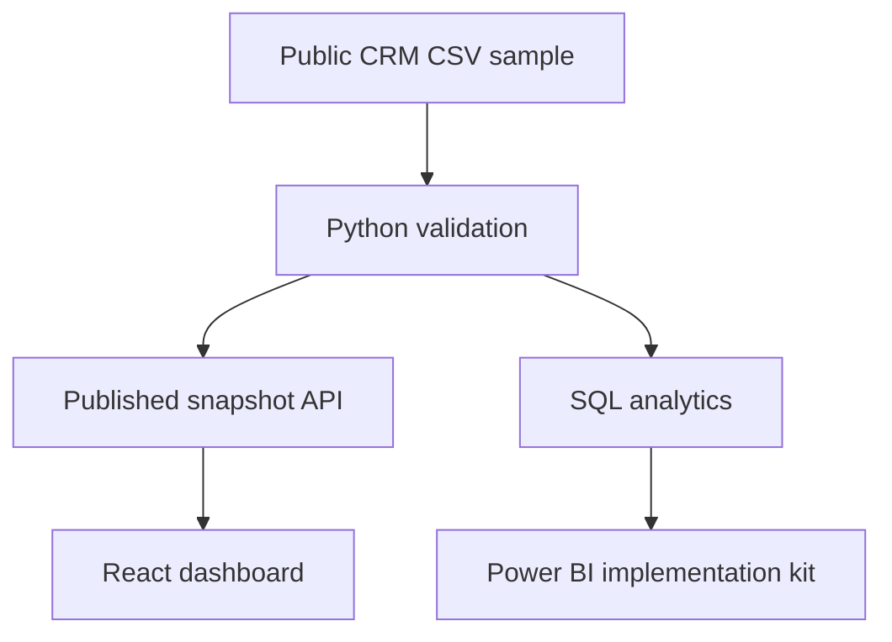
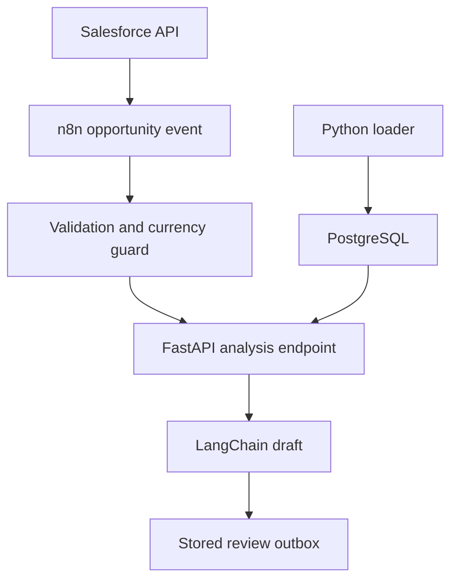

# Architecture and implementation status

The public site is a React analytics application with an API-loaded published snapshot, source inspection and reader filters. It is not an always-on Salesforce connection.

The separately runnable integration path is:

The integration path is implemented as code/configuration and locally tested where dependencies are available. Salesforce credentials, hosted API URL, PostgreSQL server, model credentials and an n8n instance are still required. Notifications are not activated. Native Salesforce reports and Power BI PBIX authoring remain pending.

Facts and recommendations are separate in both rules output and the model schema. Source opportunity IDs accompany findings. Model output is a draft requiring human review; a valid schema cannot guarantee grounding. The app never interprets absence of an amount as zero revenue or invents forecasts for open deals.
